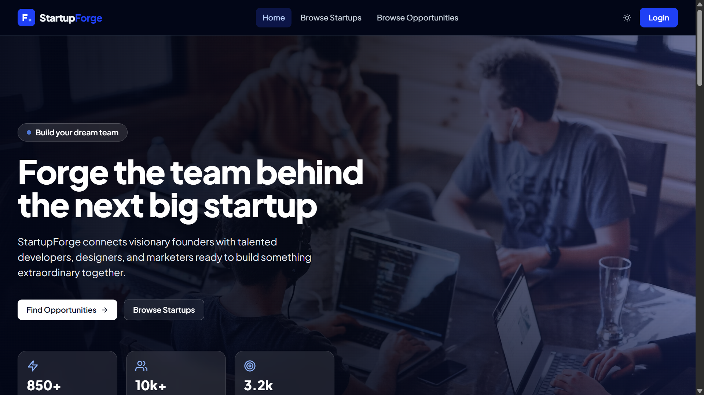

# StartupForge Client

StartupForge is a full-stack platform for startup founders to publish their startups, post collaboration opportunities, review applications, and build early teams. Collaborators can browse startup opportunities, apply to roles, and track their application status from a dedicated dashboard.

## Live Project

- Live site: https://startupforge-client-nine.vercel.app
- Client repository: https://github.com/actuallyayon/startupforge-client
- Server repository: https://github.com/actuallyayon/startupforge-server

## Screenshot



## Technologies Used

- Next.js 15 with the App Router
- React 18
- Tailwind CSS
- TanStack Query
- Better Auth
- Axios
- Framer Motion
- Recharts
- Stripe
- imgbb
- Vercel

## Core Features

- Founder, collaborator, and admin role-based dashboards
- Email/password authentication and Google sign-in
- Startup browsing with detailed startup pages
- Opportunity browsing with server-side search, filters, and pagination
- Founder tools for creating startups, posting opportunities, reviewing applications, and upgrading to premium
- Collaborator tools for applying to opportunities, tracking applications, and managing profile details
- Admin tools for managing users, startup approvals, transactions, and revenue insights
- Stripe checkout flow for founder premium upgrades
- Responsive dark and light themed UI
- Next.js API rewrites for first-party API calls through `/api/*`

## Dependencies

Main runtime dependencies:

- `@stripe/stripe-js`
- `@tanstack/react-query`
- `axios`
- `better-auth`
- `framer-motion`
- `next`
- `react`
- `react-dom`
- `react-hook-form`
- `react-hot-toast`
- `react-icons`
- `recharts`

Development dependencies:

- `autoprefixer`
- `postcss`
- `tailwindcss`

## Run Locally

Follow these steps to run the client on your machine.

1. Clone the repository.

```bash
git clone https://github.com/actuallyayon/startupforge-client.git
cd startupforge-client
```

2. Install dependencies.

```bash
npm install
```

3. Create a local environment file.

```bash
cp .env.example .env.local
```

On Windows PowerShell, use:

```powershell
Copy-Item .env.example .env.local
```

4. Add the required environment variables in `.env.local`.

```env
API_PROXY_TARGET=http://localhost:5000
NEXT_PUBLIC_IMGBB_KEY=your_imgbb_api_key
NEXT_PUBLIC_STRIPE_PUBLIC_KEY=pk_test_xxx
```

5. Start the backend server.

Use the StartupForge server repository and make sure it is running on the same URL used in `API_PROXY_TARGET`.

6. Start the development server.

```bash
npm run dev
```

7. Open the app in your browser.

```text
http://localhost:3000
```

## Available Scripts

```bash
npm run dev
npm run build
npm run start
```

## Project Structure

```text
app/
  dashboard/          Role-based dashboard routes
  login/              Login page
  opportunities/      Opportunity listing and details
  payment-success/    Stripe success redirect page
  register/           Registration page
  startups/           Startup listing and details
src/
  components/         Shared UI and dashboard components
  context/            Auth and theme providers
  lib/                API, auth, and imgbb helpers
public/
  startupforge-screenshot.png
```

## Relevant Resources

- Next.js documentation: https://nextjs.org/docs
- Tailwind CSS documentation: https://tailwindcss.com/docs
- TanStack Query documentation: https://tanstack.com/query/latest
- Better Auth documentation: https://www.better-auth.com/docs
- Stripe documentation: https://docs.stripe.com
